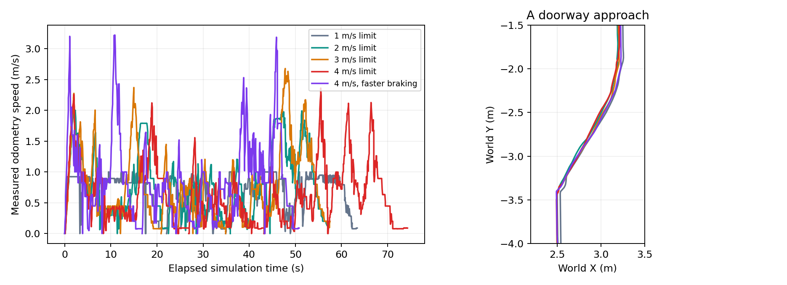

# 圆形全向底盘高速档与雷达降采样实测

2026-10-03，在 `/home/polarbear/ws_aic_mecanum_20261002` 测试。最终默认最高合速度 **4.0 m/s**、平移加速度 **2.0 m/s²**、正常减速度 **5.0 m/s²**，DWB、平滑器和最终保护一致。真实双雷达各 **811 点、270°、8 Hz 仿真频率**。历史 `/home/polarbear/ws_aic` 未覆盖。

用户指出仿真可通过修改质量、摩擦等改善制动。当前底盘是理想平面速度驱动，轮胎牵引/质量不是正常速度链的直接限制；最终保护零速还位于平滑器之后。因此先调整实际生效的 DWB/平滑器加减速参数，未为了获得更短耗时随意改重量或摩擦。快档再次走完同一目标路线，**81.13 墙钟 / 50.80 仿真秒**，无恢复，实际峰值 **3.220 m/s**，门口进出通过，最近雷达点 **0.643 m**，入口偏离最大 **0.102 m**。

与原 4 档相比墙钟少 **43.2%**、仿真时间少 **31.6%**；与原 2 档相比墙钟少 **24.9%**、仿真时间少 **11.3%**。加减速和预测范围一起调整，动态相位/实时因子也有变化，不能将全部差异归因于单一参数。

取消受保护的直线 FollowPath 时实际速度 **3.099 m/s**，之后约 **0.82 墙钟秒 / 0.50 仿真秒**、前进 **1.020 m** 后速度低于 0.05 m/s；最终命令为零。样本中平滑器逐级降速，完整保护链保持开启。这是导航取消后的正常制动，不是绕过保护的瞬时传送/强制停车。时间读数来自仿真时钟，受发布粒度/异步收包影响，仅为本次测量。首次拟从 3.5 m/s 取消，但该趟预判/跟踪只达到 3.206 m/s，已取消并保存失败样本；第二次从可实际达到的 3.0 m/s 阈值测试，没有关闭避障。

快档预测时长按更强制动匹配为 **1.8 s**，前方裁剪 **8.0 m**、局部地图 **18×18 m**、标记/清障 **8/9 m**；原 0.405 m 停车圈、2 s TTC、失联阈值及内置轨迹预测保持。隔离真实 DWB 弯道最大偏离 **0.0946 m**、短曲尾成功，9 项预测回归通过。运行配置与 odom/AMCL 两份源码配置同步为该快档。

## 结果与默认选择

固定目标序列：出生侧锚点 `(-11.5,1.1)` → 长走廊 `(4,1.1)` → A 区 `(2.593086,-5.727858)` → 返回锚点。预定位、各段之间的等待和配置重启不计入表中。四档都完成三段 NavigateToPose，均无导航恢复；运行中动态障碍持续运动，路径会重新规划。

| 上限 m/s | 实际里程计峰值 m/s | 墙钟合计 s | 仿真合计 s | 最近有效雷达点到车中心 m | 相对当前参考路径最大偏离 m |
|---:|---:|---:|---:|---:|---:|
| 1 | 1.000 | 128.67 | 63.40 | 0.647 | 0.130 |
| 2 | 2.000 | 108.01 | 57.30 | 0.614 | 0.147 |
| 3 | 2.677 | 112.09 | 57.50 | 0.413 | 0.132 |
| 4 | 2.360 | 142.77 | 74.30 | 0.515 | 0.233 |
| 4（快加减速） | 3.220 | 81.13 | 50.80 | 0.643 | 0.205 |

仅提高上限的这一轮，2 档比 1 档墙钟少 **16.1%**、仿真时间少 **9.6%**。3 档未进一步改善总耗时，且出现距离原 0.405 m 停车圈仅约 8 mm 的雷达点；4 档更慢、偏离更大。此阶段先选 2 档，用户继续提出加强制动后增加上述快档，最终采用经过实测的 4 档快配置。

表中峰值是在综合路线实测的速度，不能把参数上限当成整段恒速。固定目标不意味着相同实际路径：动态相位没有重置、规划路径长度不同，仿真实时因子也波动。每档只有一次最终完整路线，不能据此宣称所有任务稳定提速或统计上的平均收益。

另做 **4 档受保护长直线**：手工直线参考从锚点到 `(4,1.1)` 再返回，由真实 DWB FollowPath 跟踪；NavFn 作可达性预检，DWB 内置轨迹预测、平滑器、Collision Monitor 和最终保护全程保留。出/返程 23.72/45.02 墙钟秒、11.1/22.0 仿真秒，实测峰值 **4.000/3.703 m/s**；最近雷达点 0.701/0.653 m，最大路径偏离 0.059/0.089 m，均到点。该测试证明仿真速度链确实能达到 4 m/s；参考路径手工固定，不代表全局规划业务路线会持续以 4 m/s 行驶。

## 高速限制与修正

首轮已经将上限提高，但 DWB 默认 `forward_prune_distance=2m`。长时间候选滚动轨迹离开截断的参考路径，被路径偏离软评分压回低速；首轮 3 档受保护直线也只达到约 1.59 m/s。这不能归因于全向轮真实牵引能力。

最终分档由保存的基线一次生成，避免累积改参数：

| 上限 m/s | 前方裁剪 m | 路径前瞻 m | 预测时长 s | 局部窗口 m×m | 标记 / 清障范围 m |
|---:|---:|---:|---:|---:|---:|
| 1 | 2.6 | 0.65 | 1.8 | 6×6 | 6 / 7 |
| 2 | 4.4 | 1.30 | 1.8 | 10×10 | 6 / 7 |
| 3 | 6.2 | 1.95 | 1.8 | 14×14 | 7 / 8 |
| 4 | 9.6 | 2.60 | 2.2 | 20×20 | 10 / 11 |

- 高档前瞻遇到圆弧时按中间参考点对弦线的偏离缩短，阈值 0.06 m；继续保留 0.6 s 执行前缀的 0.12 m 路径约束。允许已有偏离逐步回到参考路径，全预测轨迹使用软评分。
- 保留原 11×11 主采样及 0.025 m/s 低速候选，增加不超过 1 m/s 的 0.2 m/s 中速网格，避免把整个采样网格大幅加密。
- 路径投影缓存分段几何、比较平方距离，只对最终最近距离开方；保持原评分含义。
- 平移加速度在初轮为 0.7 m/s²、减速度 2.5 m/s²，快档改成 2.0/5.0。预测时长和地图范围按对应的制动限制匹配。
- 规划包络半径 0.45 m 加 0.01 m padding、物理碰撞足印半径 0.325 m、原 0.405 m 停车圈、2 s TTC 保护全部保留。扫描/命令/地图派生位姿失联停车阈值没有放宽。

## 雷达降采样

新车型左右真实雷达从各 1081 点、10 Hz 改为各 811 点、8 Hz，扫描范围仍 270°，最大测距仍 30 m。名义射线量从 **21620 → 12976 条/s**，减少约 **40%**。角间距约 0.333°，7 m 处间距约 4.1 cm，仍小于 5 cm 地图格；没有增加插值分辨率。

左右 `/scan_left`、`/scan_right` 仍从各自真实原点标记/清障。兼容 `/scan` 保留 1441 个投影容器格，未知格仍 NaN；它不是新增 1441 条物理射线，也没有从虚构原点清障。

隔离真实 Nav2 使用等效全周 1081 点、8 Hz，圆形障碍移动后残影格数 **0**，固定真实障碍仍占用 **100**。现场检查左右 raw 与处理后的扫描都是 811 点、约 8.0 Hz 仿真频率。8 Hz 的墙钟帧率随实时因子变化；一次稳定空闲测量约 4.97 Hz，不能写成恒定 8 个墙钟帧/s。复查曾出现左右 raw、处理和兼容话题同步约 1.62 s 墙钟间隔，配置频率仍为 8 Hz；配置检查与连续墙钟新鲜度分开记录，生产失联停车阈值未放宽。最终稳定测量通过，完整业务中是否还会出现这种停顿尚未验证。

清障试验只覆盖有限几何与距离，初轮 4 档的 10 m 标记 / 11 m 清障范围已超过该角分辨率能逐格覆盖的距离；最终快档改为 8 m 标记 / 9 m 清障，8 m 处射线间距约 4.65 cm。没有测量 Foxglove 界面 FPS，也没有证明降采样单独带来的端到端加速比例。

## 回归、部署与恢复

- 真实 DWB 三档曲线、门口重放、短曲尾回归通过；曲线最大偏离分别 0.112 / 0.125 / 0.104 m。
- 三档真实最终保护的前向、反向、斜向合速度限幅及扫描/命令/位姿失联停车通过。原测试 .8 s 窗口不足以容纳 .6 s 超时后的 5 个 50 ms 零速样本，改成 1 s 测试窗口；生产保护阈值不变。
- 三档真实 DWB 横穿、迎面、过期预测、近目标、内置直线/折返等 9 个预测回归通过。
- 选择性构建 `bot_navigation` 成功。最终 odom 与 AMCL 两套新车型配置同步为 4 档快起步/制动配置，真实传感器模型与代码同步到独立运行副本。

雷达参数要修改 Gazebo 的真实传感器，单独恢复 Nav2 无法改变射线数。尝试实体重载时 URDF 注释触发 ros2_control 参数解析失败，随后控制器未正确恢复；改为只重启 Gazebo 进程组。保留主控/机械臂业务进程及已抓取标记，通过保存真位姿恢复机器人和全部十个物块。Gazebo 重启自动选择了 WSL DNS 代理地址，导致 Gazebo CLI 控制/查询失效；显式使用 `GAZEBO_IP=127.0.0.1` 后恢复，启动 launch 同样默认采用环回，允许显式覆盖。原两蓝 B 任务仍为完成状态，没有重发抓取业务。

原始大样本、首次受限结果、失败诊断和参数备份位于 `/home/polarbear/aic_speed_ladder_20261003`，首轮在 `pre-prune/`。源码旁保留 [紧凑结果](speed-ladder-evidence-20261003/summary.json) 和实际轨迹图。Gazebo 仍是理想平面速度驱动，以上结果不是实体全向轮牵引性能证据；未重测完整抓取放置任务和所有动态相遇。
